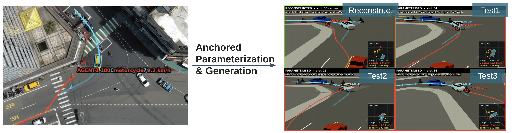
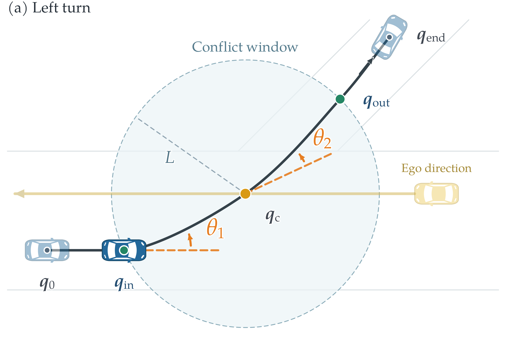
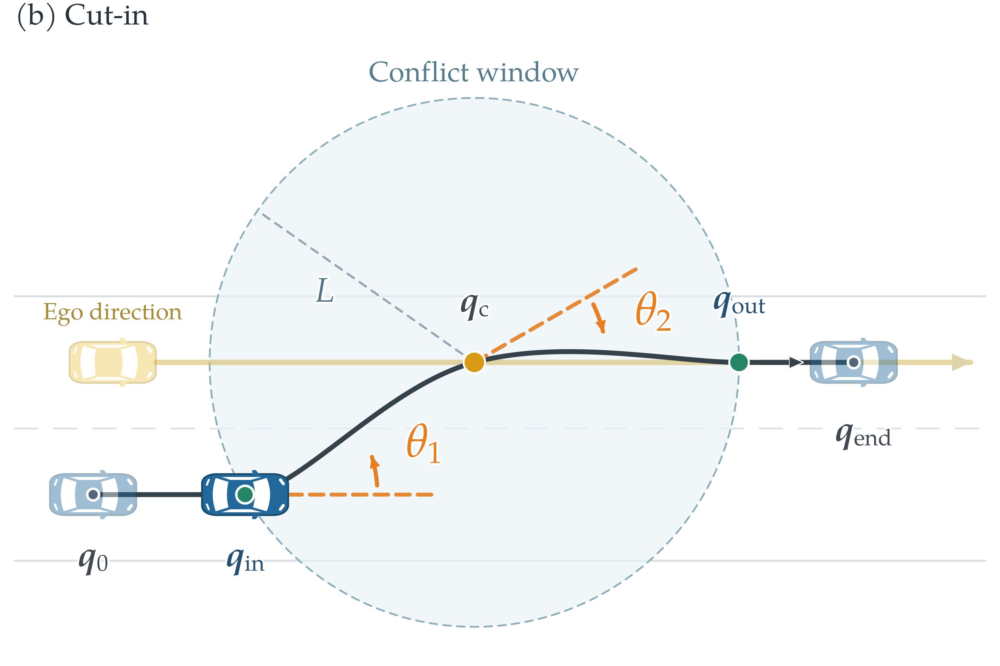

<div align="center">

# From Real-World Heterogeneous Traffic to Parameterized Scenarios
### Conflict-Anchored Parameterization for Automated Vehicle Testing

**從真實異質交通到參數化情境：應用於自動駕駛系統測試之衝突錨定參數化方法**

[Cheng-Yu Wu](https://github.com/derekwuchengyu) &nbsp;·&nbsp; Advisor: Yi-Ting Chen

Institute of Computer Science and Engineering, National Yang Ming Chiao Tung University

Master's Thesis, 2026

</div>

<p align="center">
  
</p>
<p align="center"><em>
From one recorded heterogeneous-traffic interaction to parameterized test scenarios.
Left: HetroD interaction 39_180, where motorcycle #180 travels against the permitted
direction and approaches car #39 nearly head-on. Right: reconstruction of the recorded
interaction and variants generated by changing the path-deflection angles θ1, θ2 and
the end speed v_end.
</em></p>

## Abstract

Replaying recorded traffic preserves observed behavior but provides limited variation
for automated vehicle testing. In heterogeneous traffic, weak lane discipline and
interactions among road users with different motion characteristics make it difficult
to vary scenarios without changing the encounter being tested. This work proposes
**conflict-anchored scenario parameterization**, which links local path geometry and
motion timing to events in an ego–target interaction. The representation varies two
geometric parameters and one speed or timing parameter while retaining the recorded
scenario context. A pipeline connects functional interaction annotations, parameter
extraction, distribution-based sampling, and executable OpenSCENARIO export, evaluated
on HetroD and inD.

## Method

<p align="center">
  
  
</p>

- **Conflict anchor.** Each target path is anchored at the spatial conflict point
  q_c of the ego–target interaction, inside a circular window of radius L.
- **Three parameters.** Two path-deflection angles (θ1, θ2) bend the path around the
  anchor. One end speed v_end sets the timing at the conflict.
- **Sampling and export.** A KDE fitted on per-class parameters draws new variants.
  Each variant is exported as an executable OpenSCENARIO (NURBS) file and run in esmini.

## Results

Comparison on left-turn and cut-in scenarios (thesis Table II). DTW and D_int measure
reconstruction. The remaining columns use 1000 KDE draws per method.

| Scenario | Method | DTW [m] ↓ | D_int ↓ | Var. ratio →1 | Cov.@1000 ↑ | Corner cov. ↑ | Off-road ↓ | Bg. collision ↓ |
|---|---|---|---|---|---|---|---|---|
| Agent-LT N→E (50) | SAKURA | 0.580 | 0.335 | 2.356 | 0.113 | 0.000 | 0.029 | 0.870 |
| | SVD (d=5) | 0.322 | **0.190** | 1.977 | **0.313** | **0.200** | 0.053 | **0.857** |
| | **Ours** | **0.263** | 0.389 | **1.652** | 0.147 | **0.200** | **0.000** | 0.859 |
| Agent-LT S→W (82) | SAKURA | 1.161 | 0.672 | 2.669 | 0.027 | 0.000 | 0.040 | 0.774 |
| | SVD (d=5) | 0.378 | **0.230** | 1.770 | 0.158 | 0.022 | 0.073 | 0.870 |
| | **Ours** | **0.302** | 0.360 | **1.417** | **0.207** | **0.289** | **0.000** | **0.735** |
| Cut-in left (58) | SAKURA | 0.912 | 0.930 | 17.018 | 0.202 | 0.222 | 0.054 | 0.800 |
| | SVD (d=5) | 0.544 | 0.510 | 7.200 | 0.039 | 0.000 | 0.533 | 0.830 |
| | **Ours** | **0.283** | **0.343** | **2.251** | **0.829** | **0.593** | **0.045** | **0.453** |
| Cut-in right (20) | SAKURA | 1.884 | 0.837 | 6.982 | 0.133 | 0.000 | **0.408** | 0.826 |
| | SVD (d=5) | 0.367 | **0.241** | 8.414 | **0.511** | 0.111 | 0.863 | 0.403 |
| | **Ours** | **0.235** | 0.324 | **4.336** | 0.378 | **0.667** | 0.815 | **0.031** |

## Code

The folder layout mirrors the original research workspace, so the relative paths
inside the scripts resolve when this repository is the working root.
`FILES.txt` lists every file.

| Thesis item | Script(s) |
|---|---|
| Table I: circular-window and anchor sensitivity | `exp_ours3_svd5/scripts/18_disk_anchor_sweep.py`, `19_disk_trajdtw_aggregate.py`, `164_pair_radius_compare.py` |
| Table II: left-turn and cut-in comparison | pipeline below, ending with `96_tables3_merged_tex.py` and `161_thesis_table2_tex.py` |
| Table III: rare cases 39_180 and U-turn 859_881 | `50/51/52_e9_*`, `153/154/156_uturn_*`, rare-case block of `89_gen_metrics_tables3.py` |
| Table IV: placement ablation, uniform vs conflict | `hetero-param/experiments/exp_sampling_six.py` |
| Teaser figure | `exp_ego64_39180/scripts/72_teaser.py` |
| Conflict-window figure | `output/conflict_parameterization/draw_conflict_window_vehicle_states.py` |

### Pipeline (`exp_ours3_svd5/scripts/`)

1. Cohort and SVD baseline: `10` → `21` → `14` → `11b` → `44`
2. Ours (θ1, θ2, v_end; NURBS xosc + esmini): `16` → `20` → `31` → `32` (uses `30`, `bbox_pet_adapter`)
3. Ours + KDE: `23b` → `20` → `31` / `32`
4. Executed SVD: `26` → `28` → `31` / `32`
5. SAKURA baseline: `25`, `85` → `86`
6. GT-support truncation and stop-at-end: `40`, `93` → `94`
7. Validity and coverage: `45`, `45b`, `46`, `46b`
8. Tables: `35` (uses `34`) → `87` → `88` → `70` → `89` → `90` → `96` → `97` → `98` → `161`

Shared library code comes from `hetero-param/hetero_param` (similarity, interaction,
esmini execution) and `sr-tlkeep-experiment/core` (SVD parameterization, KDE sampling).

### Requirements

- Python 3 with numpy, pandas, scipy, scikit-learn, matplotlib, pyarrow
- [esmini](https://github.com/esmini/esmini), placed at `esmini/bin/esmini`

### Data (not included)

- HetroD tracks and labels: `HetroD/`, `HetroD-labeler/data/00_tracks.parquet`, `00_labeled_scenarios.json`
- Map: `retrieval-scenarios/data/map/tyms.xodr`
- inD (Table IV only)
- Intermediate inputs from earlier experiments: `exp_cross_coverage/data/`,
  `exp_cross_coverage/esmini_runs/_xosc_base_*`, `exp_cov_sampling/results/templates_*.csv`,
  `exp_cp3_points/results/*.csv`, `hetero-param/results/esmini/xosc_base/`

### Notes

- Some scripts still contain absolute workspace paths and fixed run ids from the final rerun.
- The thesis versions of Tables II and III include small manual edits after generation:
  a column swap in Table II and a merged U-turn group in Table III.

## Citation

```bibtex
@mastersthesis{wu2026conflictanchored,
  author = {Wu, Cheng-Yu},
  title  = {From Real-World Heterogeneous Traffic to Parameterized Scenarios:
            Conflict-Anchored Parameterization for Automated Vehicle Testing},
  school = {National Yang Ming Chiao Tung University},
  year   = {2026}
}
```
