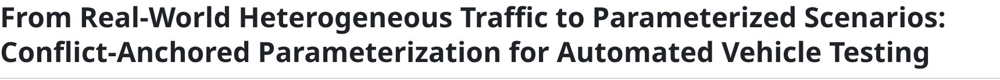
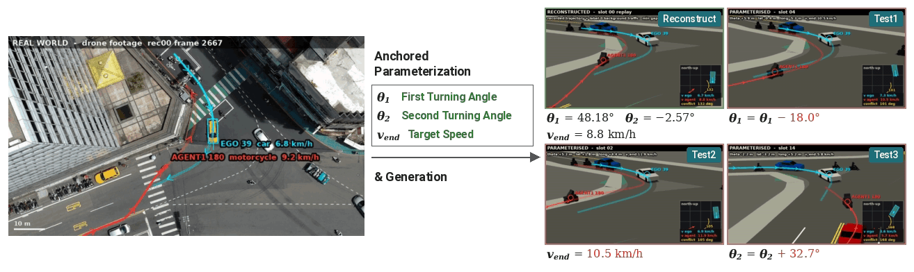
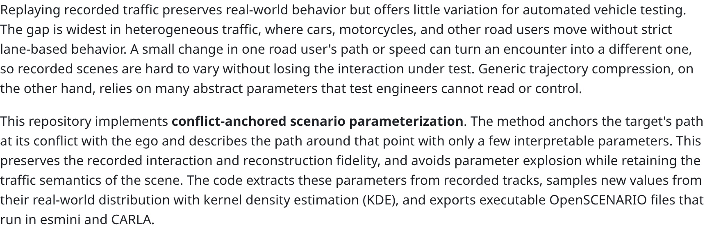
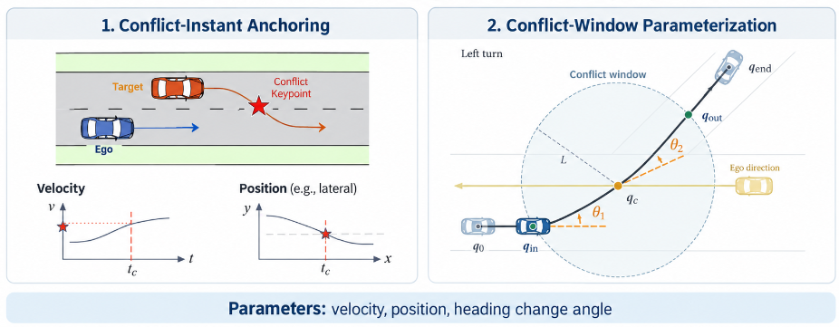
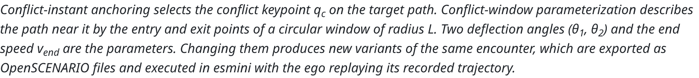
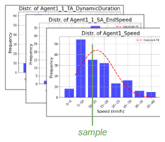
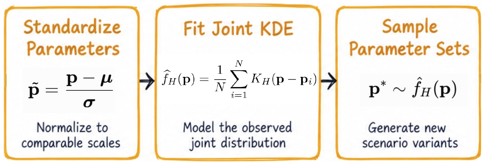
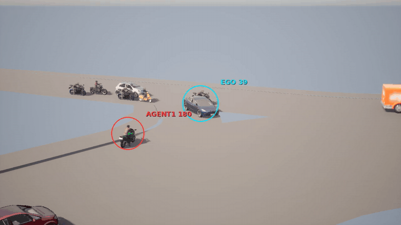
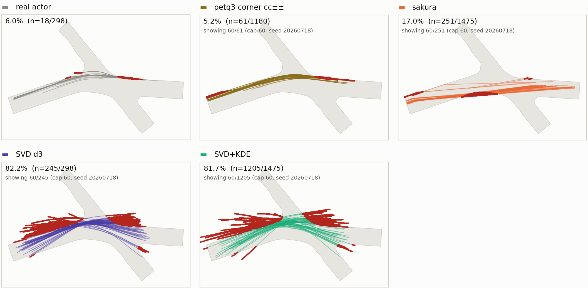
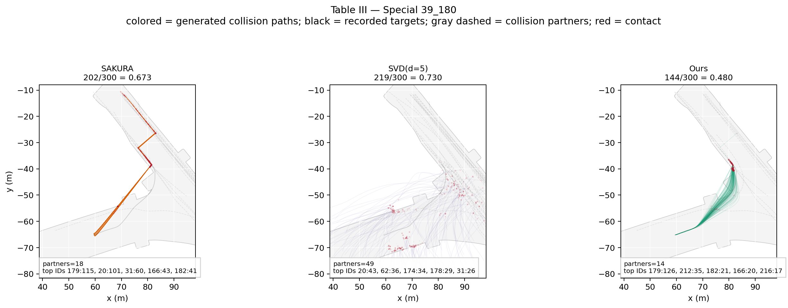

<picture>
  <source media="(prefers-color-scheme: dark)" srcset="images/text/title_dark.png">
  
</picture>

[](#)

> **Note:** The paper is currently under review and will be linked here once it is publicly available. The code in **this repository is a demo** of the core parameterization, shown with selected figures. The complete, fully runnable code will be released after the paper submission.

**Author:** Cheng-Yu Wu &nbsp;·&nbsp; **Advisor:** Yi-Ting Chen  
**Affiliation:** Institute of Computer Science and Engineering, [National Yang Ming Chiao Tung University](https://www.nycu.edu.tw)

<p align="center">
  
</p>

*From one recorded heterogeneous-traffic interaction (left, HetroD drone-based dataset) to its reconstruction and parameterized test variants executed in esmini (right).*

### About

<picture>
  <source media="(prefers-color-scheme: dark)" srcset="images/text/about_dark.png">
  
</picture>

<p align="center">
  
</p>

<picture>
  <source media="(prefers-color-scheme: dark)" srcset="images/text/caption_method_dark.png">
  
</picture>

<p align="center">
  
  &nbsp;&nbsp;
  
</p>

<picture>
  <source media="(prefers-color-scheme: dark)" srcset="images/text/caption_sampling_dark.png">
  
</picture>

<p align="center">
  <a href="images/carla_39_180.mp4"></a>
</p>

<picture>
  <source media="(prefers-color-scheme: dark)" srcset="images/text/caption_carla_dark.png">
  
</picture>

### System Requirements
* Linux (tested on Ubuntu 22.04)
* Python 3 (tested on Python 3.10) with numpy, pandas, pyarrow, pyyaml
* [esmini](https://github.com/esmini/esmini) (tested on v2.50) — only needed to execute scenarios

```
conda env create -f environment.yaml
conda activate conflict-anchored
```

### Data Preparation

| Input | Description |
|---|---|
| Tracks | Recorded trajectories in levelXdata format (HetroD, inD): `trackId, frame, xCenter, yCenter, heading [deg], xVelocity, yVelocity, length, width` (.parquet or .csv) |
| Scenario list | One ego–target interaction per row: `scenario_id, class, ego, target, min_frame, max_frame`; optional `base_xosc`, `anchor_frame` |
| Base scenarios | Logical OpenSCENARIO files from [retrieval-scenarios](https://github.com/derekwuchengyu/retrieval-scenarios). Agent1 must follow one order-4 Nurbs (3 start points, weighted shape points, 1 end point) |
| Map | OpenDRIVE map of the site (e.g. `tyms.xodr`) |

`data/scenarios_hetrod00.csv` lists the 466 HetroD recording-00 interactions used in the thesis.
The per-class settings (anchor type and window radius L) are in `configs/hetrod.yaml`.
For the S→W left-turn class, the thesis used anchors from a precomputed PET table; they are given in the `anchor_frame` column, which overrides the configured anchor.

## Usage

### 1. Extract parameters

Find the conflict anchor on the target track (PET, trajectory crossing, or minimum distance), build the circular window, and compute (θ1, θ2, v_end):
```
python extract_params.py --tracks 00_tracks.parquet --scenarios data/scenarios_hetrod00.csv \
    --config configs/hetrod.yaml --out output/params.csv
```

### 2. Sample new parameters

Fit a Gaussian KDE (leave-one-out bandwidth) per class and draw new parameter vectors:
```
python sample_params.py --params output/params.csv --n 1000 --seed 20260910 --out output/samples.csv
```

### 3. Generate scenarios

Write one OpenSCENARIO file per row. Use `params.csv` to reconstruct the recorded interactions or `samples.csv` for the sampled variants:
```
python generate_scenarios.py --params output/samples.csv --base-dir <base_xosc_dir> --out output/scenarios
```

Add `--run` to execute each scenario in esmini with the ego replaying its recorded trajectory:
```
python generate_scenarios.py --params output/samples.csv --base-dir <base_xosc_dir> --out output/scenarios \
    --run --tracks 00_tracks.parquet --xodr tyms.xodr --esmini esmini/bin/esmini
```
Each scenario folder contains `scenario.xosc` (logical scenario), `run.xosc` (esmini replay), `run.csv` (esmini log) and `trajectory.csv`.

### Code Structure
```
core/
  anchor.py   conflict anchor: PET / trajectory crossing / minimum distance
  pet.py      post-encroachment time with vehicle footprints
  window.py   circular conflict window: entry q_in and exit q_out
  theta.py    deflection angles (θ1, θ2) and their inverse
  kde.py      Gaussian KDE with leave-one-out bandwidth
  xosc.py     write control points and end speed into a base scenario
  esmini.py   ego-replay conversion, esmini execution, log parsing
extract_params.py  sample_params.py  generate_scenarios.py
```

## Results

### Off-road

<p align="center">
  
</p>

*Off-road check on the class where the ego turns left and the target goes straight (298 recorded scenarios). Only flagged trajectories are drawn; red marks the points outside the drivable area. Each panel reports the flagged share of all generated variants.*

### Background collision

<p align="center">
  
</p>

*Background-collision check on the rare wrong-way motorcycle case 39_180 (300 variants per method). Colored lines are generated paths that collide with recorded background traffic, and red marks the contact points.*

## Citation

```
@mastersthesis{wu2026conflictanchored,
  title  = {From Real-World Heterogeneous Traffic to Parameterized Scenarios:
            Conflict-Anchored Parameterization for Automated Vehicle Testing},
  author = {Wu, Cheng-Yu},
  school = {National Yang Ming Chiao Tung University},
  year   = {2026}
}
```
